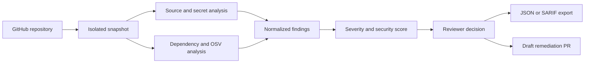

# Chrollo

> Turn a GitHub repository into an explainable security review—without executing a single line of its code.

**Chrollo** is an open-source repository security workspace built by **Phantom Troupe** for HackSpire. Give it a GitHub URL and it creates an isolated snapshot, searches for security risks, normalizes the evidence, and turns noisy scanner output into a review that a developer can actually act on.

### [Launch Chrollo →](https://chrollo-5rer9qee6-samriddhachaudhury-5891s-projects.vercel.app/)

## From repository to decision



Chrollo uses a shallow clone during local development and a commit-pinned GitHub archive on Vercel. The repository is treated as untrusted data throughout the scan: project scripts, build steps, hooks, and dependencies are never executed.

## Why Chrollo?

Security tools are good at producing alerts. They are less good at answering the questions that matter next:

- What exactly triggered this finding?
- How serious is it in this repository?
- What should the developer change?
- Has the risk improved since the previous scan?
- Can the result move into an existing review workflow?

Chrollo keeps the evidence, explanation, decision, comparison, and export in one focused workspace.

## What it can find

### Source-code risks

- Command and NoSQL injection
- Cross-site scripting and unsafe evaluation
- Disabled TLS verification
- Multiline JavaScript, Python, Java, and React patterns
- Secrets with redacted evidence
- Secrets exposed in recent Git history when running locally

### Dependency risks

- Known vulnerable version baselines
- Live [OSV.dev](https://osv.dev/) queries with an offline fallback
- npm, Python, Go, Ruby, Composer, and Rust lock-file coverage
- Optional Semgrep, Gitleaks, and OSV-Scanner adapters

### Review and reporting

- Normalized severity, evidence, remediation, and scoring
- Stable finding fingerprints across line changes
- Approve and dismiss decisions
- Severity, scanner, and security-score charts
- Baseline-versus-rescan comparisons
- JSON and SARIF 2.1 exports
- Optional AI explanations initiated by the reviewer
- Draft remediation pull requests after approval

## Built with guardrails

Chrollo was designed to scan hostile repositories without trusting them.

- Repository code is never executed.
- Snapshots use random temporary directories and are removed after scanning.
- Repository, scan, file, response, and clone-disk sizes are bounded.
- External scanners receive isolated, secret-free environments.
- Evidence containing secrets is redacted before storage or display.
- Write operations enforce same-origin protection and rate limits.
- The scan queue applies back-pressure instead of accepting unlimited work.
- Supabase provides durable history, with a local-store fallback.
- Vercel scans use commit-pinned, size-limited GitHub archives.

## Run it locally

### Requirements

- Node.js 20 or newer
- Git available on `PATH`
- Internet access for repository cloning and live vulnerability queries

Install dependencies and start the application:

```powershell
npm install
npm start
```

Open <http://127.0.0.1:4173>.

For automatic restart while developing:

```powershell
npm run dev
```

## Optional production scanners

If Semgrep, Gitleaks, or OSV-Scanner are installed on the host, enable their adapters with:

```text
CHROLLO_EXTERNAL_SCANNERS=true
```

Available tools are merged with Chrollo's built-in results. Missing tools are skipped, so the core application remains usable.

## Verify the project

```powershell
npm run check
npm test
```

## API map

| Method | Route | Purpose |
|---|---|---|
| `GET` | `/api/health` | Runtime, persistence, and AI status |
| `GET` | `/api/metrics` | Queue, storage, memory, and uptime metrics |
| `GET` | `/api/jobs/:id` | Scan progress and completed result |
| `GET` | `/api/scans` | Recent scan summaries |
| `POST` | `/api/scans` | Scan a GitHub repository URL |
| `GET` | `/api/scans/:id` | Full normalized scan |
| `GET` | `/api/scans/:id?format=json` | Download a JSON report |
| `GET` | `/api/scans/:id?format=sarif` | Download a SARIF 2.1 report |
| `POST` | `/api/scans/:id/rescan` | Scan the repository again |
| `POST` | `/api/scans/:id/findings/:findingId/decision` | Approve or reject a recommendation |
| `POST` | `/api/scans/:id/findings/:findingId/explain` | Generate an optional AI explanation |
| `POST` | `/api/scans/:id/findings/:findingId/remediate` | Create an approved draft remediation PR |

Example scan request:

```json
{
  "repositoryUrl": "https://github.com/owner/repository"
}
```

## Project structure

```text
api/                 Vercel Function entry point
dist/                browser application
server/app.js        local HTTP server and API routing
server/repository.js isolated repository acquisition
server/scanners.js   source, secret, and dependency scanners
server/service.js    scan orchestration and reviewer decisions
server/store.js      durable and local persistence adapters
supabase/            database schema
test/                automated tests
```

## Scope

Chrollo is an explainable hackathon security tool—not a replacement for a mature SAST platform or a professional penetration test. Its built-in rules prioritize useful evidence and safe execution. Public multi-user installations should still use strong access control, isolated workers, durable storage, and established scanners for deeper interprocedural analysis.

---

Built by **Phantom Troupe** for HackSpire.
